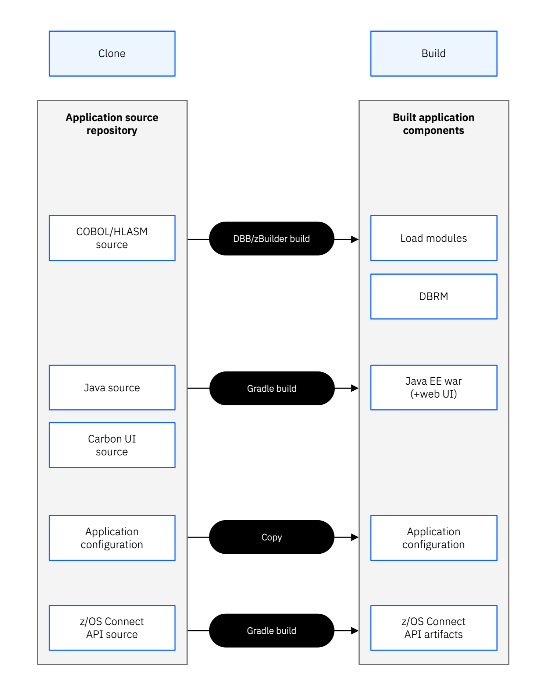
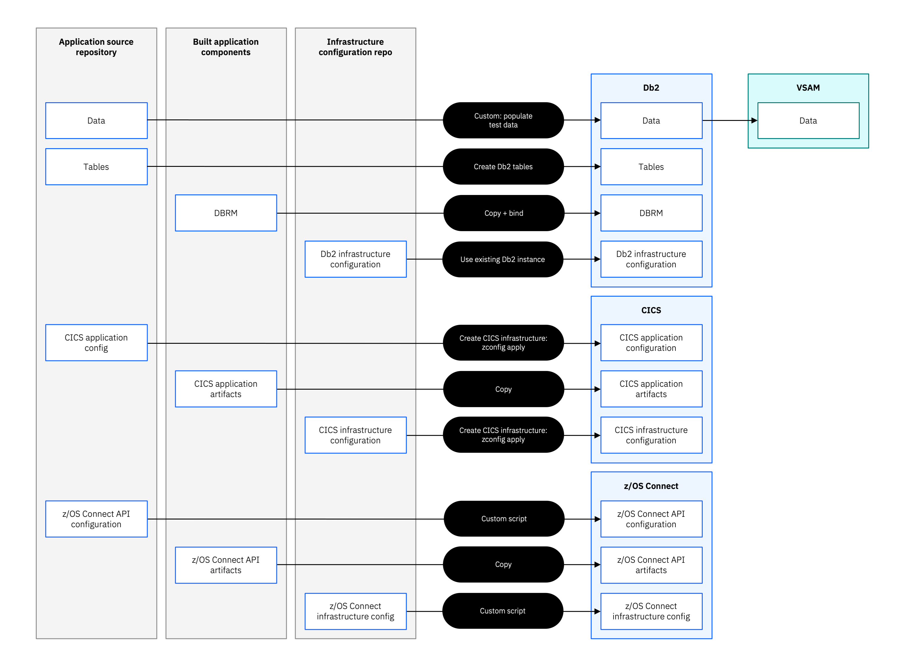
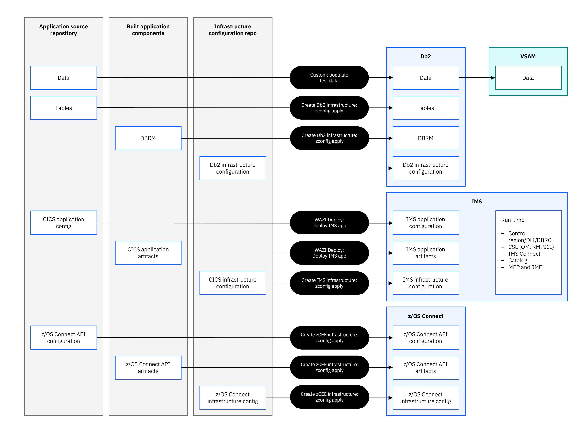

# Build and Deployment Architecture

This page describes how Bank of Z source code is transformed into deployable artifacts and how those artifacts are provisioned across the CICS and IMS runtime environments. The automation tooling — DBB, Wazi Deploy, zconfig, and the z/OS Connect CLI — handles all of this automatically when you run the deployment stages.

## Build Pipeline

The build process uses IBM Dependency Based Build (DBB) to compile and package all application source into deployable artifacts.

*Figure 1. Relationship between source assets and generated application components.*

Source assets in the repository include:

- COBOL, PL/I, and Assembler application programs
- BMS map definitions
- Db2 source definitions
- Java application source
- z/OS Connect API definitions

The build produces:

- Load modules (COBOL, PL/I, Assembler, BMS)
- Db2 tables and plans
- Java archive (JAR) files
- z/OS Connect API artifacts
- A Wazi Deploy deployment archive packaging all of the above

## CICS Deployment

After the build, Wazi Deploy installs the generated artifacts into the CICS runtime provisioned by zconfig. z/OS Connect APIs are configured to route requests to the CICS transaction-processing environment.

*Figure 2. CICS, Db2, and z/OS Connect deployment workflow.*

## IMS Deployment

IMS application artifacts are deployed to the IMS region provisioned by zconfig. z/OS Connect APIs are configured to route requests to the IMS Transaction Manager environment.

*Figure 3. IMS TM/DB, Db2, and z/OS Connect deployment workflow.*

## Tooling Summary

| Tool | Role |
|---|---|
| IBM DBB | Compiles and packages all application source |
| Wazi Deploy | Deploys the build archive to CICS and IMS |
| zconfig | Provisions CICS and IMS regions |
| z/OS Connect CLI | Configures and starts z/OS Connect APIs |

For a description of what each deployment stage does at runtime, see [Deploying Bank of Z](../installation-and-setup/deploying.html).
